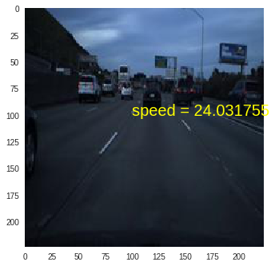
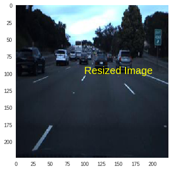

# Vehicle Speed Estimation

## Task
Given a frame/video of dashboard camera, the task is to predict the Speed of the vehicle.



## Task Insights
### Convolutional Neural Network:
When we think about this problem in Deep Learning perspective, the first thought is to use a Convolutional Neural Network to extract the features of each frame and use fully connected layers to regress the output(speed).

#### Data Processing
But the data is not completely useful for this task as the sky or the car dash is not contributing for estimating the speed of the vehicle.


So we crop out the sky and the car dash.


and resize it into a square matrix to feed it to the neural network



#### Transfer Learning
As the data involves vehicles, pedestrians, ...etc, it is not possible for me to train a model from scratch(due to computational reasons), so we take the advantage of transfer learning by using pretrained models(which were trained over million of data and poweful GPUs). 

We first keep the pre trained weights of CNN layers and add a FCC classifier in the end and train the classifier for our task with MSELoss. Later we unfreeze some CNN layers so that the CNNs extract the features which are needed for the task.

```python
model = torchvision.models.X(pretrained=True)   
for param in model.parameters():
    param.requires_grad = False
    
for param in model.selected_features.parameters():
    param.requires_grad = True

```
X - any pretrained model of choice(due to computational purpose i used AlexNet, I tried using other models too but they were very slow in training)

And add a trainable classifier at the end
```python
classifier = torch.nn.Sequential(nn.Linear(512, 256),
                           nn.ReLU(),
                           nn.Dropout(0.2),
                           nn.Linear(256, 128),
                           nn.ReLU(),
                           nn.Dropout(0.2),
                           nn.Linear(128, 64),
                           nn.ReLU(),
                           nn.Dropout(0.2),
                           nn.Linear(64, 1),
                           nn.ReLU())
model.fc = classifier
```
The CNN Model is
```
AlexNet(
  (features): Sequential(
    (0): Conv2d(3, 64, kernel_size=(11, 11), stride=(4, 4), padding=(2, 2))
    (1): ReLU(inplace)
    (2): MaxPool2d(kernel_size=3, stride=2, padding=0, dilation=1, ceil_mode=False)
    (3): Conv2d(64, 192, kernel_size=(5, 5), stride=(1, 1), padding=(2, 2))
    (4): ReLU(inplace)
    (5): MaxPool2d(kernel_size=3, stride=2, padding=0, dilation=1, ceil_mode=False)
    (6): Conv2d(192, 384, kernel_size=(3, 3), stride=(1, 1), padding=(1, 1))
    (7): ReLU(inplace)
    (8): Conv2d(384, 256, kernel_size=(3, 3), stride=(1, 1), padding=(1, 1))
    (9): ReLU(inplace)
    (10): Conv2d(256, 256, kernel_size=(3, 3), stride=(1, 1), padding=(1, 1))
    (11): ReLU(inplace)
    (12): MaxPool2d(kernel_size=3, stride=2, padding=0, dilation=1, ceil_mode=False)
  )
  (avgpool): AdaptiveAvgPool2d(output_size=(6, 6))
  (classifier): Sequential(
    (0): Linear(in_features=9216, out_features=1024, bias=True)
    (1): ReLU()
    (2): Dropout(p=0.2)
    (3): Linear(in_features=1024, out_features=512, bias=True)
    (4): ReLU()
    (5): Dropout(p=0.2)
    (6): Linear(in_features=512, out_features=256, bias=True)
    (7): ReLU()
    (8): Dropout(p=0.2)
    (9): Linear(in_features=256, out_features=1, bias=True)
    (10): ReLU()
  )
)
```

When the model is trained with Adam Optimizer with lr=1e-3 for 50 epochs, 
```
Epoch: 1/50  Training Loss: 191.244  Test Loss: 26.860 
Validation loss decreased (inf --> 26.860056).  Saving model ...
Epoch: 2/50  Training Loss: 184.863  Test Loss: 20.556 
Validation loss decreased (26.860056 --> 20.555820).  Saving model ...
Epoch: 3/50  Training Loss: 138.888  Test Loss: 20.118 
Validation loss decreased (20.555820 --> 20.117861).  Saving model ...
Epoch: 4/50  Training Loss: 94.037  Test Loss: 18.397 
Validation loss decreased (20.117861 --> 18.397253).  Saving model ...
Epoch: 5/50  Training Loss: 67.736  Test Loss: 17.306 
Validation loss decreased (18.397253 --> 17.306036).  Saving model ...
Epoch: 6/50  Training Loss: 86.508  Test Loss: 21.395 
Epoch: 7/50  Training Loss: 49.428  Test Loss: 19.769 
Epoch: 8/50  Training Loss: 41.393  Test Loss: 16.113 
Validation loss decreased (17.306036 --> 16.112900).  Saving model ...
Epoch: 9/50  Training Loss: 23.331  Test Loss: 14.344 
Validation loss decreased (16.112900 --> 14.343948).  Saving model ...
Epoch: 10/50  Training Loss: 23.345  Test Loss: 14.337 
Validation loss decreased (14.343948 --> 14.336511).  Saving model ...
Epoch: 11/50  Training Loss: 23.899  Test Loss: 14.769 
Epoch: 12/50  Training Loss: 23.372  Test Loss: 14.211 
Validation loss decreased (14.336511 --> 14.211410).  Saving model ...
Epoch: 13/50  Training Loss: 20.840  Test Loss: 14.221 
Epoch: 14/50  Training Loss: 20.422  Test Loss: 14.730 
...
...
```
